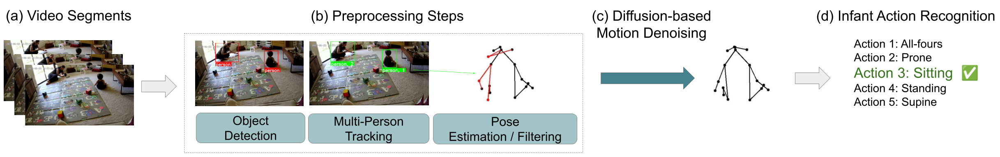
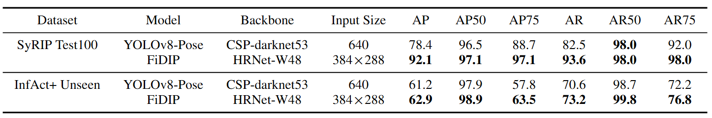
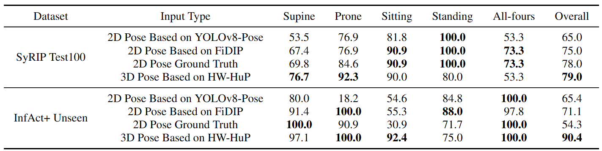

# Vision-Based Infant Action Recognition

Codes and experiments for the following paper:
Yanjun Zhu, Xiaofei Huang, Elaheh Hatamimajoumerd, Pooria daneshvar Kakhaki, Agata Lapedriza, Sarah Ostadabbas. “Vision-Based Infant Action Recognition”


### Table of Contents
1. [Introduction](#introduction)
2. [Environment](#environment)
3. [Data Preparation](#data-preparation)
    1. [Preprocessing Data](#preprocessing-data)
    2. [Data Download](#data-download)
4. [Validation of Data Processing](#validation-of-data-processing)
    1. [External Resources](#external-resources)
    2. [Validation Results](#validation-results)
5. [Infant Action Recognition](#infant-action-recognition)
    1. [Training](#training)
    2. [Testing](#testing)
    3. [Visualizing](#visualizing)
6. [Diffusion-based Motion Denoising](#diffusion-based-motion-denoising)
    1. [Training-](#training-)
    2. [Testing-](#testing-)

## Introduction

This repository contains the code for the paper "Vision-Based Infant Action Recognition". We propose a novel method for infant action recognition that combines a graph convolutional network (GCN) with a diffusion-based motion denoising (DMD) model. The GCN is used to extract the spatial and temporal features of the infant's skeleton data, while the DMD model is used to denoise the motion data. We introduce InfAct+, the first publicly accessible benchmark designed for real-world, vision-based infant action recognition. This dataset comprises two distinct sources: pro- cessed video segments sourced from public YouTube content and daily activity video clips recorded from recruited participants. InfAct+ encompasses a diverse range of infant actions, from fundamental motor skills to complex transitional movements, providing a comprehensive foundation for studying infant motor development.



The code is divided into main parts: Infant Action Recognition and Diffusion-based Motion Denoising. The former is responsible for training and testing the action recognition model, while the latter is responsible for training and testing the diffusion-based motion denoising model.

## Environment

Prepare the virtual environment:

You can use the provided YAML file to create the environemt:
```shell
conda env create -f environment.yml
conda activate infant_denoising
```

Otherwise, you will need to ensure that you have the following packages:
```shell
pytorch
torchvision
tqdm
matplotlib
scikit-learn
seaborn
numpy
pandas
```

This code base is tested with python=3.11.0 and PyTorch==2.3.0

## Data preparation

### Preprocessing Data
For object detection and multi-person tracking, please refer to [Ultralytics YOLO Docs](https://docs.ultralytics.com/modes/track/ "Multi-Object Tracking with Ultralytics YOLO"). For our implementation, we used "Yolov8-pose" and "BOT-SoRT" tracker.

For infant-specific pose estimation, please refer to [Fine-tuned Domain-adapted Infant Pose (FiDIP)](https://github.com/ostadabbas/Infant-Pose-Estimation "Github Repository of FiDiP")

### Data Download
<a name="INFANTS"></a>
We have also added the processed skeletons of the INFANTS dataset directly for download.
Preprocessed  INFANTS skeleton data can be downloaded 
[here](https://drive.google.com/file/d/10z5dbOXk76nOhmeLpYDnNtnOT1xYGvkc/view?usp=sharing)<br/>
Put downloaded data into the following directory structure:

```
- Data/
  - INFANTS/
    -INFANTS.pkl
```


## Validation of Data Processing

### External Resources

In this session, we used two datasets to verify the effectiveness of our data processing pipeline:

- **SyRIP Test100**  
- **InfAct+Unseen**  

Please download the data from [here](https://drive.google.com/drive/u/1/folders/1jG8kK8ZqZttuscyt1HhM1bR-pqF4EwDc). The raw data are stored in the 'custom_data' folder in **COCO format**. Additional folders contain:

- **2D pose predictions:** [FiDIP](https://github.com/ostadabbas/Infant-Pose-Estimation) and [YOLOv8-Pose](https://github.com/autogyro/yolo-V8)  
- **3D pose predictions:** [HW-HuP](https://github.com/ostadabbas/HW-HuP)  
- **Posture results:** [Posture classifier](https://github.com/ostadabbas/Infant-Posture-Estimation)  

For more details, please refer to the original paper.

### Validation Results
1. **2D Pose Estimation Comparison:** FiDIP vs. YOLOv8-Pose for infant 2D pose estimation on frames from InfAct+Unseen and SyRIP Test100 datasets.

   


2. **Posture Classification Accuracy Comparison (%):** Using different input data sources:  

   - 2D pose from YOLOv8-Pose  
   - 2D pose from FiDIP  
   - 2D pose ground truth  
   - 3D pose from HW-HuP  
   
   


## Infant action recognition

### Training
To train the action recognition model, the train script must be executed
assuming the code root as ``${REC_ROOT}``, please navigate into the InfantGCN directory by
```shell
cd ${REC_ROOT}/InfantGCN
```
To start the training, use the following script:

```shell
python train.py [--epochs] [--model] [--base_lr] [--repeat] [--output_folder] [--exp_name]
```

#### Arguments

- `model`: The model which is used as the backbone of the recognition model. Please use either `CTRGCN` or `STCGN`
- `base_lr`: The learning rate of the optimizer. Default value is `0.1`
- `repeat`: Number of times that the training dataset is repeated to increase the size of the dataset
- `output_folder`: The parent folder where the results will be saved
- `exp_name`: The folder where the results will be saved

#### Example:

```shell
python train.py --epochs 15 --model CTRGCN --base_lr 0.1 --repeat 1 --output_folder ../Results --exp_name CTRGCN_REC
```

The results of the following experiments will be saved in ``${REC_ROOT}/Results/CTRGCN_REC``<br/>
In each experiments, weights after each training epoch will be save as ``$epoch_{epoch_num}.pth``<br/>
The weights which yields the best validation accuracy will be saved as ``best_results.pth``

### Testing
To test the action recognition model, the test script must be executed
assuming the code root as ``${REC_ROOT}``, please navigate into the InfantGCN directory by
```shell
cd ${REC_ROOT}/InfantGCN
```
To start the inference, use the following script:

```shell
python test.py [--model] [--weights] [--output_folder] [--exp_name]
```

#### Arguments

- `model`: The model which is used as the backbone of the recognition model. Please use either `CTRGCN` or `STCGN`
- `weights`: The weights which will be loaded into the model
- `output_folder`: The parent folder where the results have been previously be saved
- `exp_name`: The folder where the results have been previously be saved

#### Example:

```shell
python test.py --model CTRGCN --weights ../Results/CTRGCN_REC/best_results.pth --output_folder ../Results --exp_name CTRGCN_REC
```

The results of the test will be save as ``${REC_ROOT}/Results/CTRGCN_REC/eval.pkl``<br/>
This pickle file contains the predicted and ground truth labels for each samples in the test dataset, and the accuracy accross the dataset

### Visualizing
To visualize the action recognition model, the test script must be executed
assuming the code root as ``${REC_ROOT}``, please navigate into the InfantGCN directory by
```shell
cd ${REC_ROOT}/InfantGCN
```
To start the visualization, use the following script:

```shell
python visualize.py [--eval_file]
```

#### Arguments

- `eval_file`: the result of the execution of a previous test command saved as a pickle file

#### Example:

```shell
python visualize.py --eval_file ../Results/CTRGCN_REC/eval.pkl
```

The visualized confusion matrix will be save as  ``${REC_ROOT}/Results/CTRGCN_REC/cm.png``<br/>

## Diffusion-based motion Denoising
After obtaining 3D infant poses, we need to transform them to the same format of Human 3.6M. Please follow https://github.com/wei-mao-2019/gsps for Human3.6M dataset preparation. 
All data needed can be downloaded from [Google Drive](https://drive.google.com/drive/folders/1sb1n9l0Na5EqtapDVShOJJ-v6o-GZrIJ?usp=sharing) and place all the dataset in ``data`` folder inside the root of this repo. 

### Training-
```
python train.py --cfg infact
```

### Testing-
```
python train.py --cfg infact --test
```

## Citation
```
```

We thank the previous work, including but not limited to [YOLOv8-Pose](https://github.com/autogyro/yolo-V8), [FiDIP](https://github.com/ostadabbas/Infant-Pose-Estimation), [HW-HuP](https://github.com/ostadabbas/HW-HuP), [CoMusion](https://github.com/jsun57/CoMusion/tree/main), [InfoGCN](https://github.com/stnoah1/infogcn), [CTR-GCN](https://github.com/Uason-Chen/CTR-GCN), [ST-GCN](https://github.com/yysijie/st-gcn).